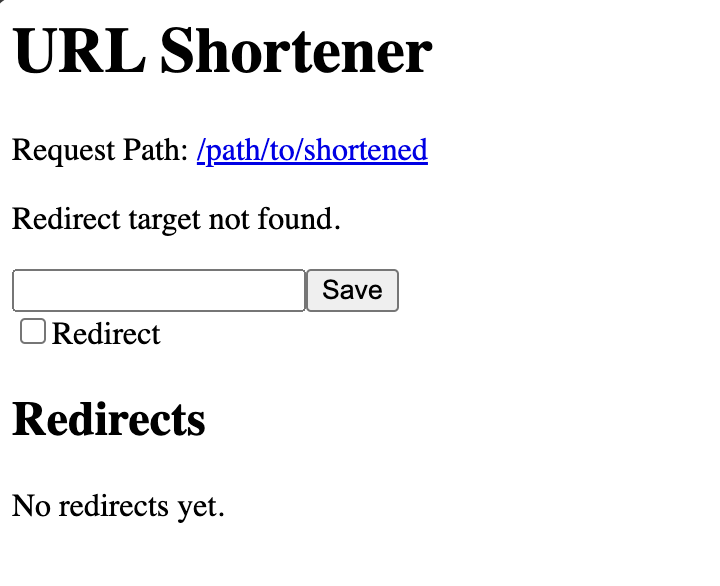

# urlshortener

It's a URL shortener.  
Easily convert long, complex URLs into concise and shareable links.  
Streamline your workflow and simplify access to frequently used resources.

## Usage

```sh
urlshortener --port 8080 --save.dir /var/lib/urlshortener/
```

#### Open shortened URL you want register

- [http://localhost:8080/path/to/shortened](http://localhost:8080/path/to/shortened)



#### Replace shortened URL with query `?edit`

- [http://localhost:8080/path/to/shortened?edit](http://localhost:8080/path/to/shortened?edit)

#### Show shortened URL list with query `?edit`

- [http://localhost:8080/?edit](http://localhost:8080/?edit)

It will display list of shortened URLs have prefix matched to path.

## Deploy

### Running with Docker Compose

Refer to the documentation in [Docker Compose Deployment](.docs/deploy/docker/README.md) for instructions on how to deploy using Docker Compose.

### Running on Kubernetes

Refer to the documentation in [Kubernetes Deployment](.docs/deploy/k8s/README.md) for instructions on how to deploy on Kubernetes.
